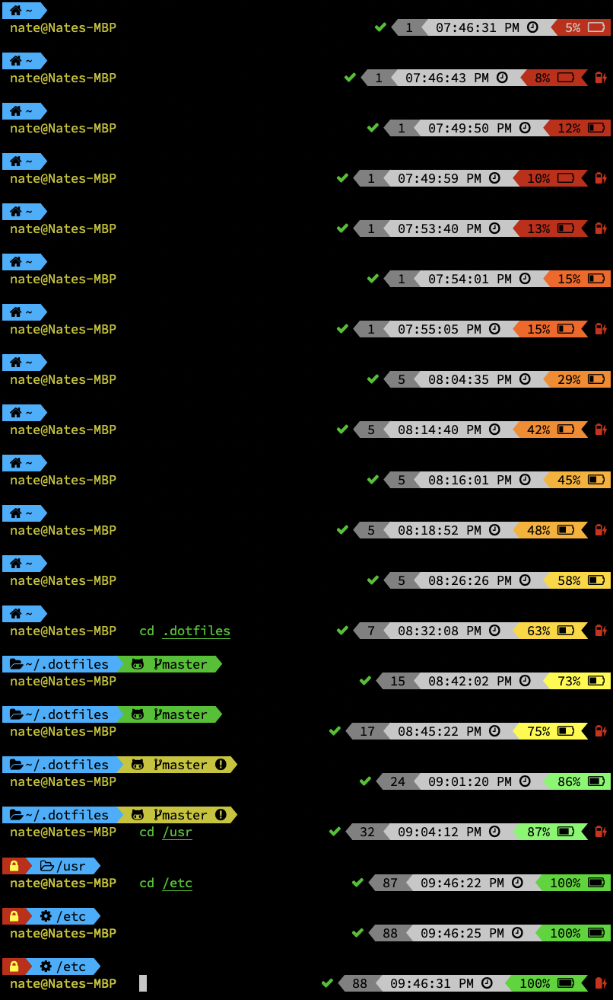

# MacOS dotfiles

## Config Files
* [`.zshrc`](zshrc)
* [`.vimrc`](vimrc)

# Screenshots





# 1. Clone This Repo To Your Home Directory

```
git clone https://github.com/natesammons/dotfiles.git ~/.dotfiles
```

# 2. Install Homebrew
Follow the instructions at [https://brew.sh/](https://brew.sh/)

```
/usr/bin/ruby -e "$(curl -fsSL https://raw.githubusercontent.com/Homebrew/install/master/install)"
```

### Install Core Tools

```
brew install coreutils
brew install findutils
brew install gnu-indent
brew install gnu-sed
brew install gnutls
brew install grep
brew install gnu-tar
brew install gawk
brew install diffutils
brew install gnu-which
brew install gzip
brew install wget
brew install less
brew install openssh
brew install rsync
brew install vim
brew install htop
brew install watch
brew install zstd
brew install awscli
brew install zsh
brew install zsh-syntax-highlighting
brew install zsh-completions
```

### Fix `zsh-completions` permissions

Fix for the following error with zsh completions:

```
zsh compinit: insecure directories, run compaudit for list.
# Ignore insecure directories and continue [y] or abort compinit [n]?
```

Run the following from inside `zsh`:

```
compaudit | xargs chmod g-w
```

See [this stackexchange.com thread](https://unix.stackexchange.com/questions/383365/zsh-compinit-insecure-directories-run-compaudit-for-list) for details.


# 3. Install the SourceCodePro "NerdFont" font

[https://nerdfonts.com/](https://nerdfonts.com/)

Go to Downloads -> SourceCodePro -> open zip file

Use “`Sauce Code Pro Medium Nerd Font Complete.ttf`” (specifically NOT the ‘mono’ version).
If you use the mono version, the icons will be too small.  The font is already monospaced.

Download the raw file, open it and install the font.  Change your iTerm profile to use this font.

# 4. Make `zsh` your default shell

### Update Available Shells
Edit `/etc/shells` to add zsh from brew.  Add the following lines:

```
# from brew
/usr/local/bin/zsh
```

### Change default shell for your user

```
chsh -s /usr/local/bin/zsh
```


# 5. Install oh-my-zsh for `zsh`

Follow the instructions at [https://ohmyz.sh/](https://ohmyz.sh/)

[https://github.com/robbyrussell/oh-my-zsh](https://github.com/robbyrussell/oh-my-zsh)

```
sh -c "$(curl -fsSL https://raw.githubusercontent.com/robbyrussell/oh-my-zsh/master/tools/install.sh)"
```

This will nuke your `.zshrc` so don’t make changes before installing it.  Run through the wizard and select the defaults.


### Install the `powerlevel10k` theme for `zsh`

[https://github.com/romkatv/powerlevel10k](https://github.com/romkatv/powerlevel10k)

```
git clone https://github.com/romkatv/powerlevel10k.git ~/.oh-my-zsh/custom/themes/powerlevel10k
```
Powerlevel10K is a [Powerlevel9k](https://github.com/bhilburn/powerlevel9k) re-implementation
that is a lot faster.

# 6. Install `Vundle` plugin for `vim`

## Install Vundle

[https://github.com/VundleVim/Vundle.vim](https://github.com/VundleVim/Vundle.vim)

```
git clone https://github.com/VundleVim/Vundle.vim.git ~/.vim/bundle/Vundle.vim
```

# 7. Symlink `.zshrc` and `.vimrc` to this repo

```
bash ./create-links.sh
```

# 8. Run `vim` to initialize newly-configured plugins


Run `vim` to install plugins:

```
vim +PluginInstall +qall
```

# 9. Launch a new terminal

It should look like the screenshot above
